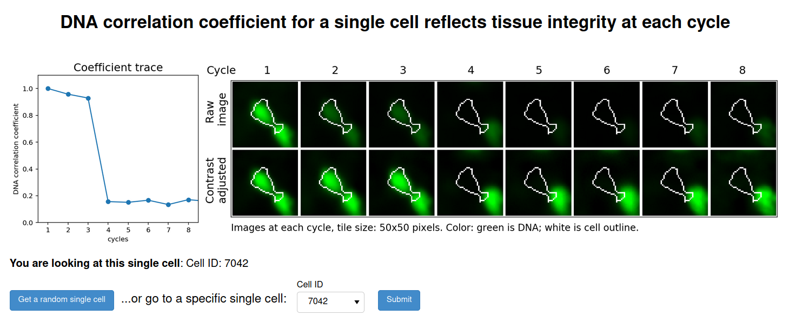

## Interactive dashboard showing DNA correlation coefficient as indicator of tissue integrity at single cell level

### Screenshot

### Instruction for local execution:
1. Install Docker engine (https://docs.docker.com/get-docker/)
2. Clone this repository  
   `git clone https://github.com/hungyiwu/dna_corrcoef_dashboard.git`
3. Build Docker image (here the image name `dnacorrcoef` and version number `0.1` are arbitrary)  
   `docker build -t dnacorrcoef:0.1 .`
4. Run Docker image  
   `docker run -it -v $PWD/code:/home/code -v $PWD/data:/home/data -p 5006:5006 dnacorrcoef:0.1`
5. Open your web browser (Chrome, Firefox, Safari, ..., etc.) and go to `http://localhost:5006/app` to see the dashboard
